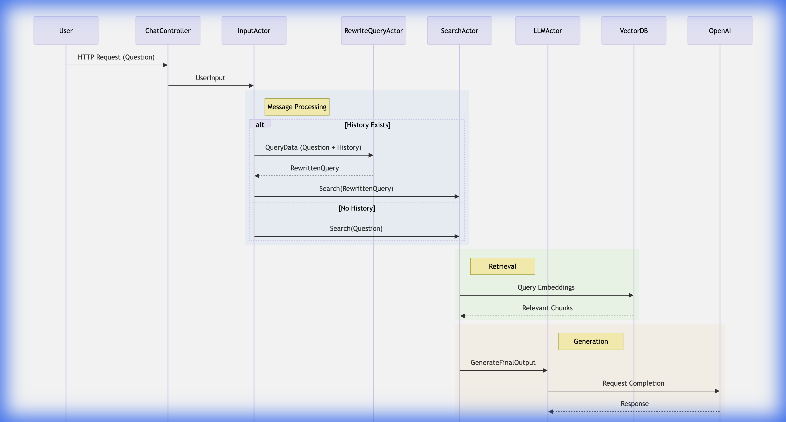

# RAG-ChatBOT

Retrieval Augmented Generation (RAG) powered ChatBot using **Akka Architecture** and **Spring Boot**.

This project implements a high-performance, concurrent ChatBot that leverages Large Language Models (LLMs) and Vector Databases to provide accurate, context-aware responses based on indexed documents.

## 🚀 Features

*   **RAG Architecture**: Combines retrieval of relevant document chunks with LLM generation for grounded answers.
*   **Akka Actors**: Utilizes the Actor Model (Akka Typed) for highly concurrent, scalable, and responsive message processing.
*   **Spring AI**: Integrates with OpenAI models (GPT-3.5/4) and embedding models via Spring AI.
*   **Vector Database**: Uses **Qdrant** for efficient vector similarity search.
*   **Hybrid Search**: (Optional) Capable of combining keyword search (Lucene) with vector search (Qdrant).
*   **Query Rewriting**: Intelligent interaction flow where queries are rewritten based on chat history to maintain context.

## 🏗️ Architecture

The system follows a reactive architecture using Akka Actors to handle user requests, retrieval, and generation asynchronously.



### Component Flow
1.  **User** sends a message via the REST API (`ChatController`).
2.  **InputActor** receives the message. 
    *   If chat history exists, it forwards the query and history to the **RewriteQueryActor** to contextually refine the question.
    *   If no history, it proceeds directly to search.
3.  **SearchActor** takes the (rewritten) query, generates an embedding, and searches the **Qdrant Vector Database** for relevant context chunks.
4.  **LLMActor** receives the original query and retrieved context, then prompts **OpenAI** to generate the final answer.
5.  The response is sent back through the actor chain to the user.

## 🛠️ Technology Stack

*   **Java 17**
*   **Spring Boot 3.4.0**
*   **Spring AI** (OpenAI)
*   **Akka Actor Typed 2.6.19**
*   **Qdrant** (Vector Database)
*   **Apache Lucene** (Text Search/Analysis)
*   **Maven**

## 📋 Prerequisites

*   **Java 17** or higher installed.
*   **Docker** (to run Qdrant).
*   **OpenAI API Key**.

## ⚙️ Configuration

1.  **Clone the repository**:
    ```bash
    git clone https://github.com/Abhinav-1502/RAG-ChatBOT.git
    cd RAG-ChatBOT
    ```

2.  **Set up Qdrant**:
    Run Qdrant using Docker:
    ```bash
    docker run -p 6333:6333 -p 6334:6334 qdrant/qdrant
    ```

3.  **Configure API Keys**:
    Open `src/main/resources/application.properties` and set your OpenAI API key or use environment variables (Recommended for security).
    ```properties
    spring.ai.openai.api-key=YOUR_OPENAI_API_KEY
    spring.ai.openai.embedding.options.model=text-embedding-3-small
    spring.ai.openai.chat.model=gpt-3.5-turbo
    ```

## 🏃‍♂️ Usage

1.  **Build the project**:
    ```bash
    mvn clean install
    ```

2.  **Run the application**:
    ```bash
    mvn spring-boot:run
    ```

3.  **Interact with the ChatBot**:
    The application exposes REST endpoints. You can use Postman or curl.
    
    *   **Endpoint**: `POST /chat` (Example)
    *   **Body**: JSON with user message.

## 🤝 Contributing

Contributions are welcome! Please open an issue or submit a pull request.
